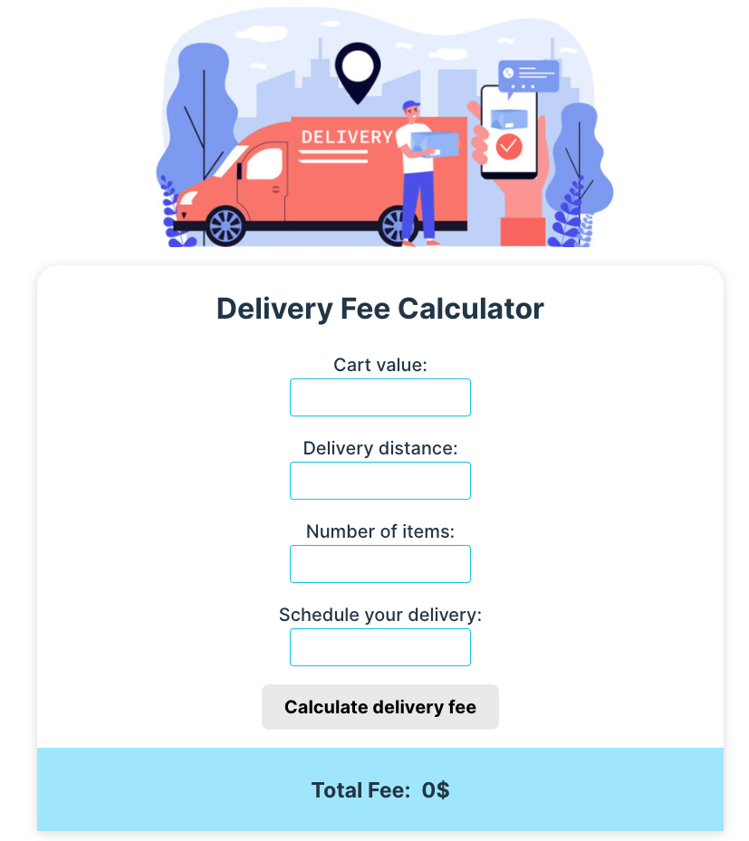

# Frontend Intern 2024 Application

---

# Wolt Challenge - Delivery Fee Calculator



With thDelivery Fee Calculator, the user can fill up a small formular that will calculate how much will cost their delivery, considering the amount of the cart value, number of items to be deliver, distance and if it is a rush time of the week.

## How to use it

Install the projet locally in your computer by typing the following in yout terminal:

```
npm install
```

Then, run it with the comand:

```
npm run dev
```

## Technologies applied

- React
- Typescript
- React @testing-library
- Jest Javascript testing framework
- React Datepicker library

---

> [My Portfolio](https://knopgm.com/)
